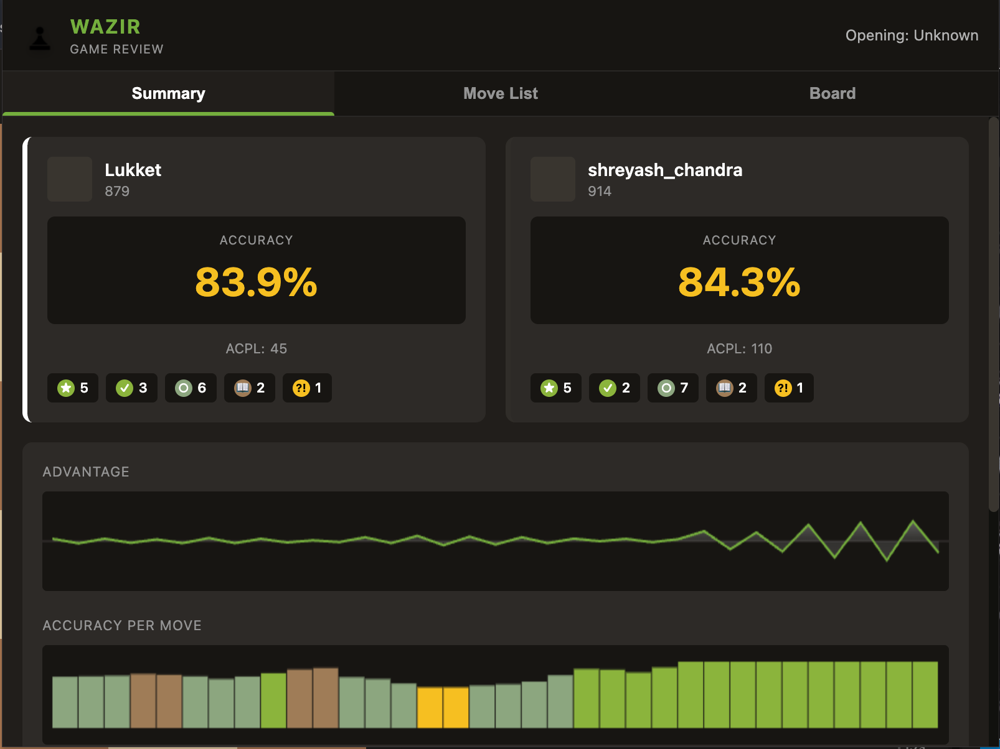
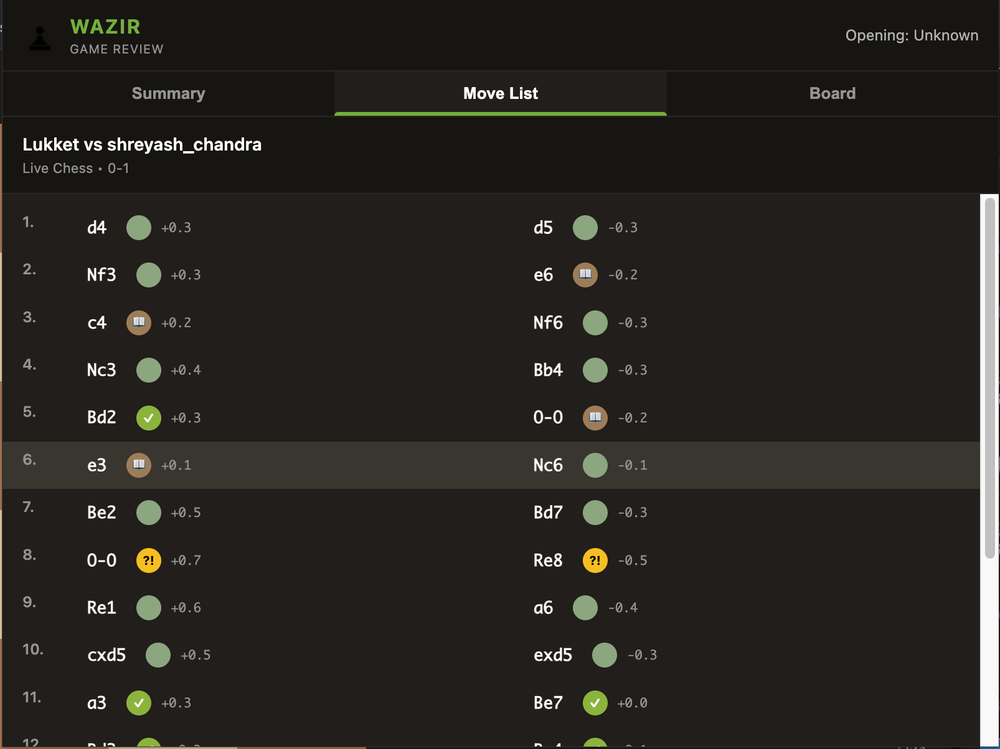
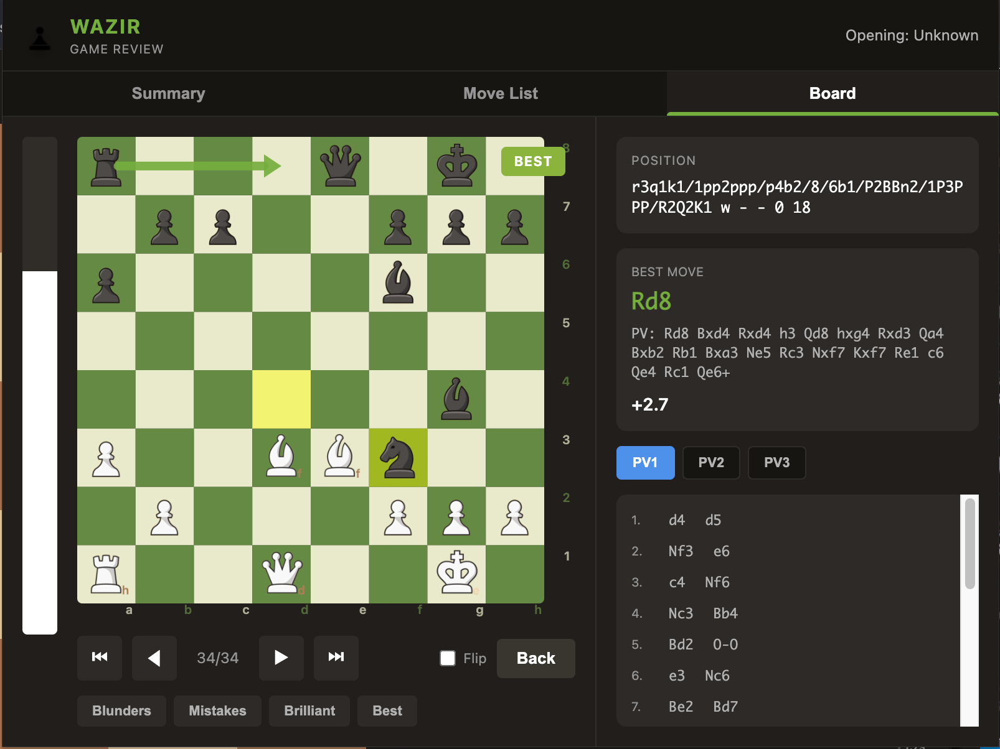

# Wazir — Chess.com Game Review (Local Stockfish)

[](https://developer.chrome.com/docs/extensions/mv3/intro/)
[](./LICENSE)
[](./CONTRIBUTING.md)
[](https://stockfishchess.org/)
[](https://developers.cloudflare.com/workers/)

Wazir is a Chrome extension that analyzes **finished Chess.com games** locally using
**Stockfish 17.1 Lite** and produces a Chess.com-style review: **accuracy**, **ACPL**,
move tags, charts, a move list, and an interactive board replay with PV lines.

> Not affiliated with Chess.com.

---

## Table of Contents

- [Features](#features)
- [Screenshots](#screenshots)
- [How it Works](#how-it-works)
- [Project Structure](#project-structure)
- [Install (Unpacked / Dev)](#install-unpacked--dev)
- [Backend (PGN API)](#backend-pgn-api)
- [Configuration](#configuration)
- [Troubleshooting](#troubleshooting)
- [FAQ](#faq)
- [Contributing](#contributing)
- [License & Credits](#license--credits)

---

## Features

- Fetch PGN from the current Chess.com game tab
- Local analysis using Stockfish 17.1 Lite (Web Worker)
- Chess.com-style **accuracy** model (win-probability based)
- **ACPL** and move classification:
  - book, good, excellent, best
  - inaccuracy, mistake, blunder
  - (plus great/brilliant heuristics)
- Charts:
  - advantage over time
  - accuracy per move
- Move list with click-to-jump
- Board view:
  - arrows for best line (PV)
  - MultiPV switching (PV1/PV2/PV3)
  - navigation + flip
  - quick filters (blunders/mistakes/brilliants/best)

---

## Screenshots

> Add your screenshots under `assets/screenshots/` and update paths below.

- Summary view  
  

- Move list  
  

- Board view  
  

---

## How it Works

1. **content.js** runs on Chess.com pages and extracts:

   - game id (live/daily/analysis URLs)
   - usernames (DOM + fallback signals)
   - timestamp/month (via Chess.com callback JSON when available)

2. **popup.js**:

   - requests context from the active tab
   - fetches the PGN from a small API (Cloudflare Worker) using username + year/month
   - parses PGN headers + SAN moves
   - runs Stockfish analysis per ply:
     - MultiPV on the position before the move
     - evaluation of the played move
   - converts eval → win% → accuracy (Chess.com-like model)
   - renders Summary / Move List / Board tabs

3. **Backend (Worker)** provides:
   - `GET /pgn?username=...&year=YYYY&month=MM`
   - returns an array of `{ gameID, PGN }`

---

## Project Structure

```text
extention/
  manifest.json
  popup.html
  styles.css
  popup.js
  popup-ui.js
  content.js
  lib/
    chess.js
  stockfish/
    *.js
    *.wasm
  pieces/
    *.png
  icons/
    *.png
```
